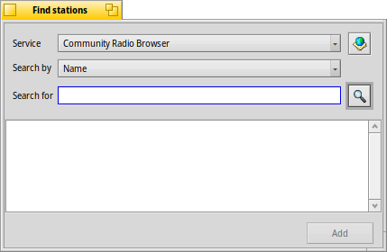
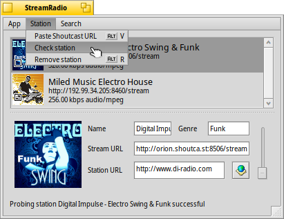

# StreamRadio user guide

StreamRadio is an open-source native Haiku internet radio player created by Fishpond and currently maintained at HaikuArchives. It allows users to find, add, manage and listen to online radio stations.

---

#### Index
*	[Installation](#part_install)
*	[First run](#part_first_run)
*	[Adding stations](#part_add_station)
*	[Start/Stop streaming a station](#part_start)
*	[Managing stations](#part_manage)
	*	[The station panel](#manage_panel)
	*	[Adding a station using Shoutcast URL](#manage_add)
	*	[Probing a station](#manage_check)
	*	[Removing a station](#manage_delete)

## Installation 

StreamRadio is available through HaikuDepot.

StreamRadio can also be built from the source available at [HaikuArchives](https://github.com/HaikuArchives/StreamRadio). It depends on libxml2 (installable with *pkgman install devel:libxml2* from Terminal).

Bugs and enhancement issues can be filed at that same HaikuArchives page. Help with translations is welcome at [Polyglot](https://i18n.kacperkasper.pl/projects/29).

## First run 

 
When StreamRadio is launched for the first time, you'll see an alert, telling you that a folder "Stations" has been created in your "settings" folder. You can link that folder to your Desktop or the Deskbar menu (*ln -s ~/config/settings/Stations ~/config/settings/deskbar/menu/*) to conveniently play stations directly.

After acknowledging that alert, an empty window opens, as you haven't added any radio stations yet. To begin, choose *Search | Find stations...* from the menu.

## Adding stations 

### Service
StreamRadio uses the [Community Radio Browser](http://www.radio-browser.info) as a service that provides a list of online radio stations. Click on the  icon next to it to open the homepage of that service.

### Search by
This menu allows you to select your search criteria, like name, tag, language, country etc.

### Search for
Here you'll enter a search term fitting the option you chose for *Search by* and click the  icon or hit <kbd>Enter</kbd> to start your search. The search may take some seconds.

The results appear in the box below. Select your preferred station, then click *Add* to add it to your list of stations. You can continue searching and adding stations like this.

When you're finished you can close the *Find stations* window.

## Start/Stop streaming a station 

  

To start streaming a station, simply double-click it. The little square on the station's icon will become a triangle to indicate "Play". The status bar will show the name of the station and the song currently playing.
  
Double-click again, and the overlay symbol turns back to a square, indicating "Stop".

You can listen to several streams simultaneously and adjust their individual volume with their volume slider. The option *App | Allow parallel playback* has to be checkmarked for that.

## Managing stations 

The main window shows the list of stations you have added. It also provides you with some options to manage your radio stations.

### The Station Panel 
The *Station panel* at the bottom of the window can be revealed and hidden by dragging the dotted line up or down. It allows the user to view and edit a few details about the radio station such as *Name*, *Genre*, *Stream* and *Station URL*.

Clicking on the  icon opens the homepage of the radio station in your browser.

The slider on the side controls the volume.

### Adding a station using the Shoutcast URL 

Instead of searching for a station you can also add a station directly with its Shoutcast URL. Just copy the URL to your clipboard, then go to *Station | Paste Shoutcast URL*.

### Checking a station 

Choose a station and go to *Station | Check station* to probe it. After a few seconds, the status bar indicates whether the station is broadcasting.

### Removing a station 

To remove a station from your collection, simply select it and go to *Station | Remove station*.
