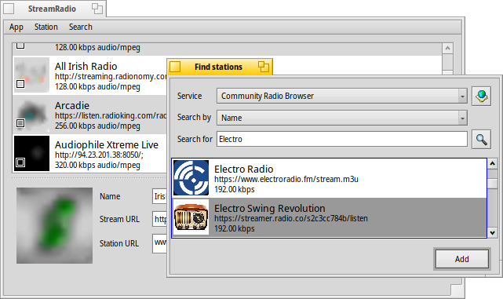

# StreamRadio user guide

StreamRadio is an open-source native Haiku internet radio player created by [Fishpond](https://github.com/fishpond-haiku/Haiku-Radio). It allows users to find, add, manage and listen to online radio stations.

### Index
*	[Installation](#part_install)
*	[First run](#part_first_run)
*	[Adding a station](#part_add_station)
*	[Managing stations](#part_manage)
	*	[The Station Panel](#manage_panel)
	*	[Adding a station using Shoutcast URL](#manage_add)
	*	[Probing a station](#manage_check)
	*	[Deleting a station](#manage_delete)

## Installation 
StreamRadio is available on HaikuDepot on both 32-bit and 64-bit Haiku. To install it, open HaikuDepot, and search for the term *StreamRadio*. Select *install* to download the package to your computer.

You can also build StreamRadio from source to get a newer (but unstable) version of 
StreamRadio. The source is available [here](https://github.com/HaikuArchives/Haiku-Radio).

## First run 

During the first time you run this app, you will see an empty window, as you haven't added any radio stations yet. To begin, click on *Search* on the menu bar.

## Add new radio stations 

To add new radio stations, select *Search* on the menu bar to begin. A dialog box will appear, allowing you to choose radio stations to add to your collection.

#### Service
Here, you can choose between two services:
- [Radio Station](http://www.radio-browser.info) - A free community radio station browser.
- [listenlive.eu](http://www.listenlive.eu/) - An experimental server, currently down.
Adding your own radio internet radio service is currently not supported.

Click on the  icon next to the service name to open the homepage of that service.

#### Search by
This menu allows you to select your search criteria. Depending on the radio service you choose, you can search based on keywords, genre, and countries.

#### Search for
This can either be a menu or a text box, according to the option you chose for *Search by*. Type in your keyword, or select your preferred type here.

After you've done with your choices, press  or hit <kbd>Enter</kbd> to start your search. The search may take up to a minute.

The results will appear in the box below. Select your preferred station, then press *Add* to add it to your list of stations. You can do this any number of times you like.

When you're finished, close *Find Stations* to return to the main window.

## Managing radio stations 

In the main window, you can see the list of stations you have added. It also provides you with a number of options to manage your radio stations.

### The Station Panel 
The *Station Panel*, located at the bottom of the window can be revealed and hidden by clicking on the arrow. It allows the user to view and edit a few details about the radio station such as the Name, Genre, Stream URL.

Clicking on the  icon next to the *Station URL* text box brings you to the homepage of the radio station.

The slider on the side of the Station Panel is the Volume Controller, which adjusts the Radio Player's volume.

### Adding a station using the Shoutcast URL 

Copy the URL onto your clipboard. Then, go to `Edit -> Paste Shoutcast URL`, and the new station will be added to your list.

### Checking a radio station 

Choose a station, then go to `Edit -> Check Station` to probe it. After a few seconds, the status bar should indicate whether the probe was successful or not.

### Deleting a radio station 

To remove a station that you no longer want from your collection, simply select it and go to `Edit -> Remove`

